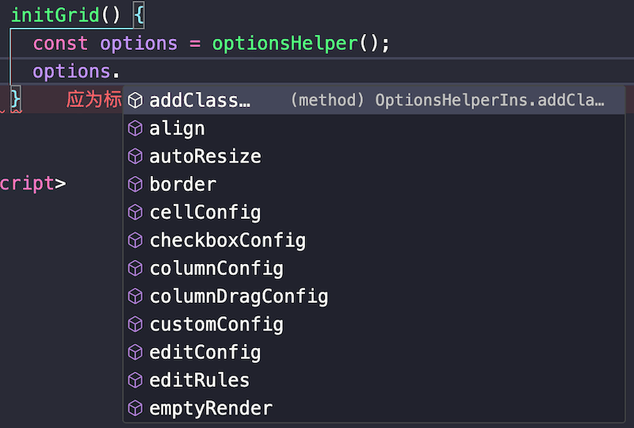
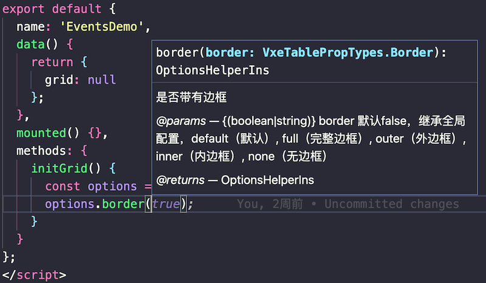
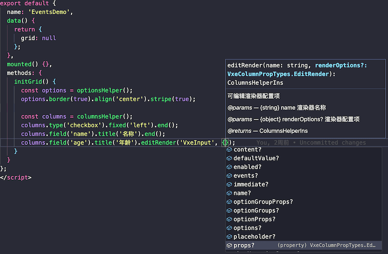
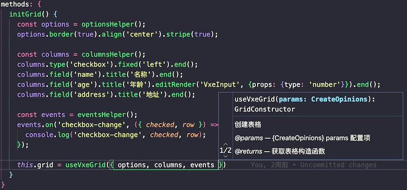

<div align="center">
  
  <p>
  
  

  </p>
  <h1>Vxe Table Middleware</h1>
</div>

     

## 简介

本工具为应用`vxe-table`时的一个中间件，基于`vxe-table`表格组件**v3.9+版本**封装，旨在提供一个创建表格和配置的方案，让 Vue2 开发的项目支持一定的类型提示，提升开发体验！

### 背景

在原公司时，使用`vxe-table`组件比较早，大概是 v1 版本时候，我封装了表格创建的中间件，原目的一是为了符合当时开发人员的习惯，将模板开发转化为 js 逻辑开发，二是为了统一各项目风格，统一更新，提升开发与管理效率。后来随着`vxe-table`大小版本升级，有一些破坏性更新，中间件的优势就体现了，我只需要修改中间件的内部逻辑就可以实现适配，各项目历史代码基本不会受影响。

24 年计划将依赖的`vxe-table`版本由 v2 升级到 v3 时候有了一些新的想法，`vxe-grid`功能也齐全了，于是除了将原方案适配到 v3，同时基于`vxe-grid`做了拓展方案，包括 grid 创建工具和配置工具，同时，由于 vue2 开发项目未使用 TS，之前的方案在使用时会经常查询文档的痛点，所以这次拓展方案通过设计了函数式编程方式以提供一定的 TS 类型支持，优化开发体验。不过离职时尚未开发完成，所以拓展方案尚未经过大量项目验证。

本工具即提取自该拓展方案，并完成了初期逻辑开发和类型文件，同时解决了后续发现的核心实现上的问题。虽然是个技术小渣渣，但是我觉得当时的思路可以分享出来，不一定直接使用本工具，也可以作为一个实现思路的参考。

## 一点说明

中间件当前适配到`vxe-table@3.18.15`。

随着`vxe-table`版本的升级，配置属性或方法有时候会有变更，但是我可能无法实时跟进，所以如果项目中使用的话建议锁定`vxe-table`版本号，其实对团队的统一性也是好的，空闲了我就会跟进更新，同时注明适配到的版本号，方便项目根据自己的情况更新。

如果项目中使用的`vxe-table`版本比当前中间件适配的版本号超前，可以提 issue 提醒我跟进更新，也可以通过中间件提供的拓展方法`helpersDecorator`自行实现，拓展方法的使用见[文档说明](http://2100.wang/vxe-table-middleware/docs/zh/extend/guide.html)

## 文档

[查看文档](http://2100.wang/vxe-table-middleware/docs/)

## 更新日志

[CHANGELOG](./CHANGELOG.md)

## 环境

- node：>=20
- pnpm: >=10
- vue: >=2.6.14

## 安装

```bash
npm install vxe-table-middleware
# 或者
yarn add vxe-table-middleware
# 或者
pnpm add vxe-table-middleware
```

## 使用

> **注意：** 本工具为使用`vxe-table`时的一个中间件，`vxe-table`的注册请参考[官方文档](https://vxetable.cn/v3/#/start/install)！
> **目前本工具依赖`vxe-grid`需要全局安装**。

### 全局注册

main.js

```javascript
import Vue from 'vue';
import VxeGridWrap from 'vxe-table-middleware';
Vue.use(VxeGridWrap);
// ...
```

单文件组件 demo.vue

```html
<template>
  <vxe-grid-wrap :grid="grid" />
</template>
<script>
  import { columnsHelper, useVxeGrid } from 'vxe-table-middleware';
  export default {
    data() {
      return {
        grid: null,
      };
    },
    mounted() {
      this.initGrid();
    },
    methods: {
      initGrid() {
        // 构造列配置
        const columns = columnsHelper();
        columns.type('checkbox').fixed('left').end();
        columns.field('name').title('名称').end();
        columns.field('age').title('年龄').end();
        columns.field('address').title('地址').end();
        // 构造表格
        this.grid = useVxeGrid({ columns });
      },
    },
  };
</script>
```

### 局部注册

单文件组件 demo.vue

```html
<template>
  <vxe-grid-wrap :grid="grid" />
</template>
<script>
  import VxeGridWrap, { columnsHelper, useVxeGrid } from 'vxe-table-middleware';
  export default {
    components: { VxeGridWrap },
    data() {
      return {
        grid: null,
      };
    },
    mounted() {
      this.initGrid();
    },
    methods: {
      initGrid() {
        // 构造列配置
        const columns = columnsHelper();
        columns.type('checkbox').fixed('left').end();
        columns.field('name').title('名称').end();
        columns.field('age').title('年龄').end();
        columns.field('address').title('地址').end();
        // 构造表格
        this.grid = useVxeGrid({ columns });
      },
    },
  };
</script>
```

## 应用举例

```html
<template>
  <vxe-grid-wrap ref="gridRef" :grid="grid" />
</template>
<script>
  import { optionsHelper, columnsHelper, eventsHelper, useVxeGrid } from 'vxe-table-middleware';
  export default {
    data() {
      return {
        grid: null,
      };
    },
    mounted() {
      this.initGrid();
    },
    methods: {
      setGridData() {
        // ！！！ 如果使用useVxeGrid构造表格后立马调用grid方法时需要使用$nextTick
        this.$nextTick(() => {
          const gridApi = useVxeGrid(this.$refs.gridRef);
          gridApi.loadData([
            { name: '张三', age: 18, address: '北京市' },
            { name: '李四', age: 20, address: '上海市' },
          ]);
        });
      },
      initGrid() {
        // 构造表格配置
        const options = optionsHelper();
        options.height(200).border(true);
        // 构造列配置
        const columns = columnsHelper();
        columns.type('checkbox').fixed('left').end();
        columns.field('name').title('名称').end();
        columns.field('age').title('年龄').end();
        columns.field('address').title('地址').end();
        // 构造事件
        const events = eventsHelper();
        events.on('checkbox-change', ({ checked, row }) => {
          console.log('checkbox-change', checked, row);
        });
        // 构造表格
        this.grid = useVxeGrid({ options, columns, events });
        this.setGridData();
      },
    },
  };
</script>
```

## 类型提示举例

> 类型提示虽然不能像直接使用 TS 开发那样丝滑，但是至少有了一定的提示，提升开发体验！
> 建议配置编辑器如 vscode 的`触发建议`快捷键，例如我配置的是`cmd + h`(Mac)，必要时可以通过快捷键触发类型提示。

以下部分类型提示示例：











## License

[MIT © 2100](./LICENSE)
