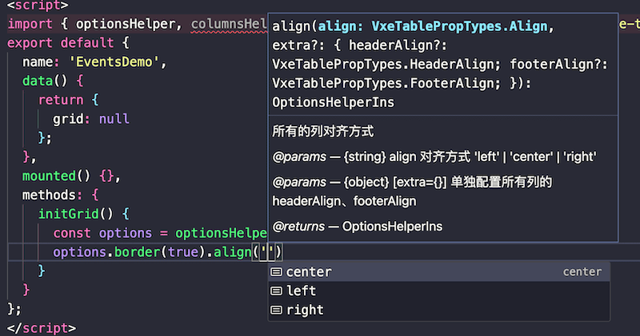

# 快速开始

::: warning
**注意：** 本工具为使用`vxe-table`时的一个中间件，`vxe-table`的注册请参考[官方文档](https://vxetable.cn/v3/#/start/install)！
**目前本工具依赖`vxe-grid`需要全局安装**。
:::

本中间件包含以下模块：

- `VxeGridWrap`：组件
- `optionsHelper`：表格配置工具
- `columnsHelper`：表格列配置工具
- `eventsHelper`：表格事件配置工具
- `useVxeGrid`：表格构造工具和 API 接口工具

## 安装

> `vxe-table`的安装与注册不再赘述

```bash
npm install vxe-table-middleware
# 或者
yarn add vxe-table-middleware
# 或者
pnpm add vxe-table-middleware
```

## 使用

::: tip
以下注册只指的是`VxeGridWrap`组件的注册，建议使用全局注册，局部注册需要在每个组件中引入比较繁琐，该组件可以理解为`vxe-grid`的壳子，代码量极少。
:::

### 全局注册

main.js

```javascript
import Vue from 'vue';
import VxeGridWrap from 'vxe-table-middleware';
Vue.use(VxeGridWrap);
// ...
```

单文件组件 demo.vue

```html
<template>
  <vxe-grid-wrap :grid="grid" />
</template>
<script>
  import { columnsHelper, useVxeGrid } from 'vxe-table-middleware';
  export default {
    data() {
      return {
        grid: null,
      };
    },
    mounted() {
      this.initGrid();
    },
    methods: {
      initGrid() {
        // 构造列配置
        const columns = columnsHelper();
        columns.type('checkbox').fixed('left');
        columns.field('name').title('名称').end();
        columns.field('age').title('年龄').end();
        columns.field('address').title('地址').end();
        // 构造表格
        this.grid = useVxeGrid({ columns });
      },
    },
  };
</script>
```

### 局部注册

单文件组件 demo.vue

```html
<template>
  <vxe-grid-wrap :grid="grid" />
</template>
<script>
  import VxeGridWrap, { columnsHelper, useVxeGrid } from 'vxe-table-middleware';
  export default {
    components: { VxeGridWrap },
    data() {
      return {
        grid: null,
      };
    },
    mounted() {
      this.initGrid();
    },
    methods: {
      initGrid() {
        // 构造列配置
        const columns = columnsHelper();
        columns.type('checkbox').fixed('left');
        columns.field('name').title('名称').end();
        columns.field('age').title('年龄').end();
        columns.field('address').title('地址').end();
        // 构造表格
        this.grid = useVxeGrid({ columns });
      },
    },
  };
</script>
```

## 应用举例

```html
<template>
  <vxe-grid-wrap ref="gridRef" :grid="grid" />
</template>
<script>
  import { optionsHelper, columnsHelper, eventsHelper, useVxeGrid } from 'vxe-table-middleware';
  export default {
    data() {
      return {
        grid: null,
      };
    },
    mounted() {
      this.initGrid();
    },
    methods: {
      setGridData() {
        // ！！！ 如果使用useVxeGrid构造表格后立马调用grid方法时需要使用$nextTick
        this.$nextTick(() => {
          const gridApi = useVxeGrid(this.$refs.gridRef);
          gridApi.loadData([
            { name: '张三', age: 18, address: '北京市' },
            { name: '李四', age: 20, address: '上海市' },
          ]);
        });
      },
      initGrid() {
        // 构造表格配置
        const options = optionsHelper();
        options.height(200).border(true);
        // 构造列配置
        const columns = columnsHelper();
        columns.type('checkbox').fixed('left').end();
        columns.field('name').title('名称').end();
        columns.field('age').title('年龄').end();
        columns.field('address').title('地址').end();
        // 构造事件
        const events = eventsHelper();
        events.on('checkbox-change', ({ checked, row }) => {
          console.log('checkbox-change', checked, row);
        });
        // 构造表格
        this.grid = useVxeGrid({ options, columns, events });
        this.setGridData();
      },
    },
  };
</script>
```

## 类型提示举例

> 类型提示虽然不能像直接使用 TS 开发那样丝滑，但是至少有了一定的提示，提升开发体验！
> 建议配置编辑器如 vscode 的`触发建议`快捷键，例如我配置的是`cmd + h`(Mac)，必要时可以通过快捷键触发类型提示。

以下部分类型提示示例：





